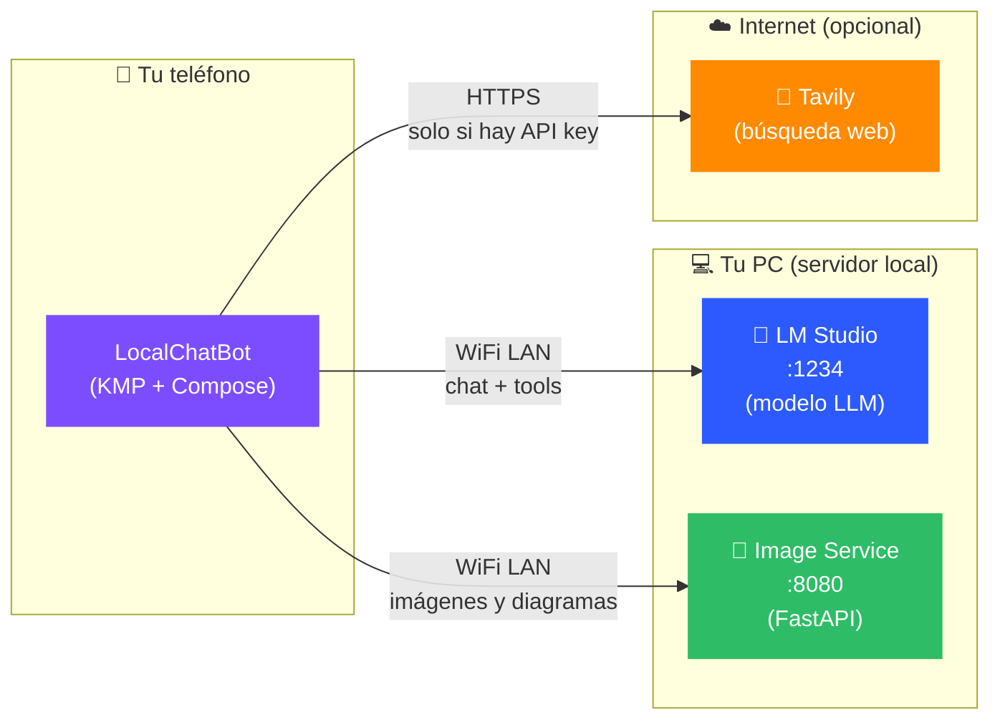
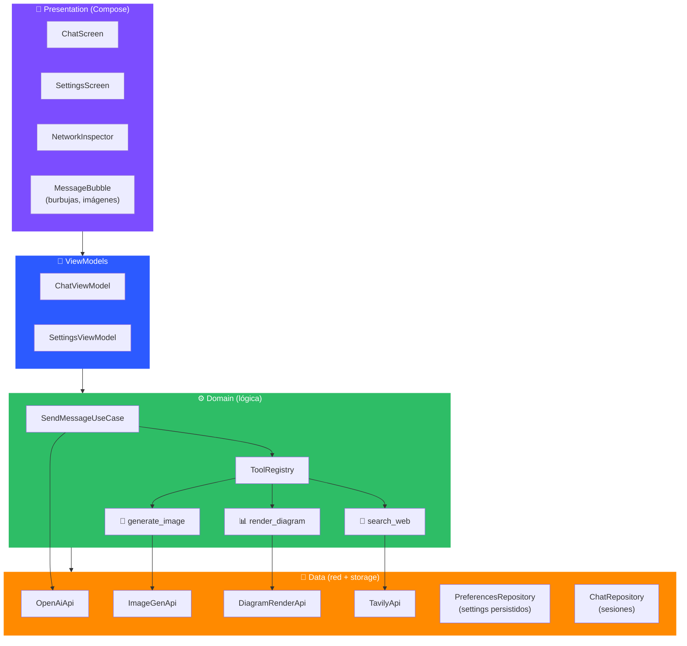
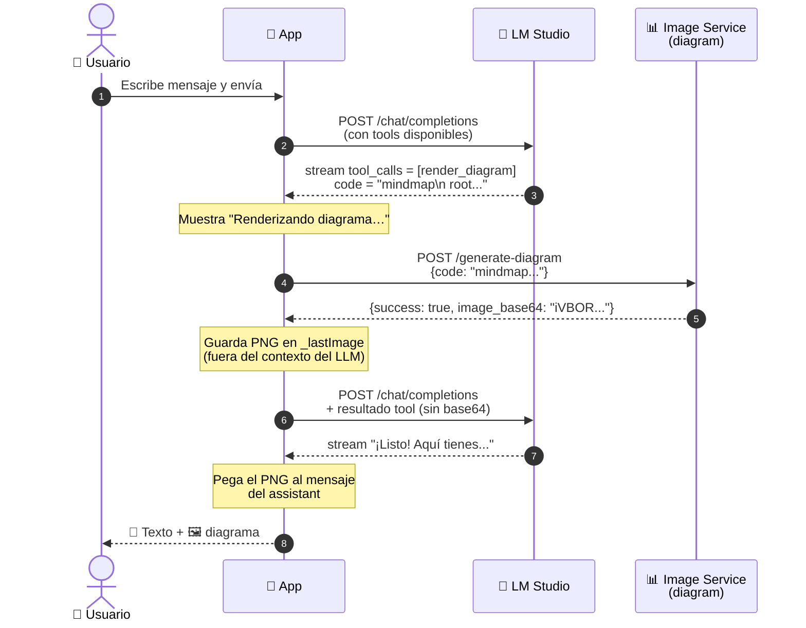
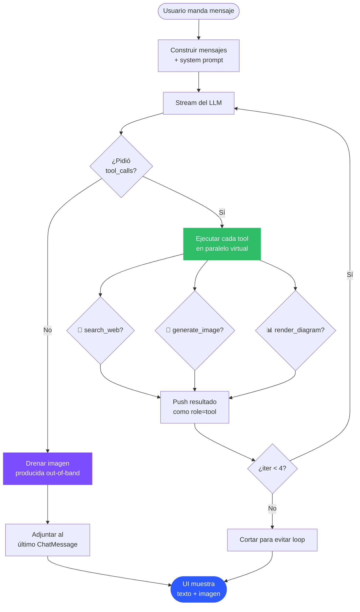
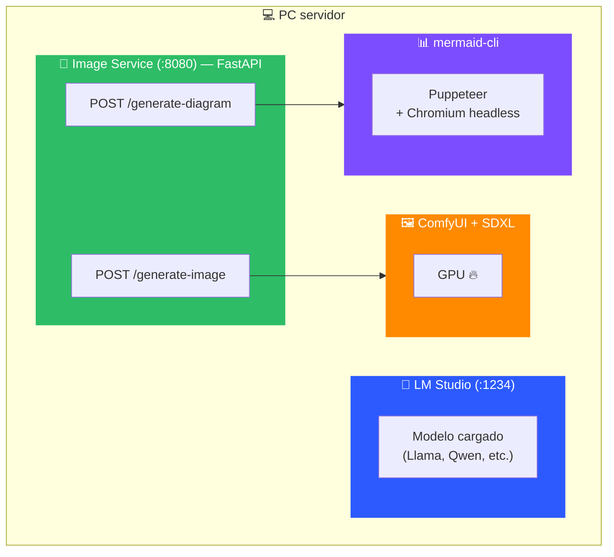
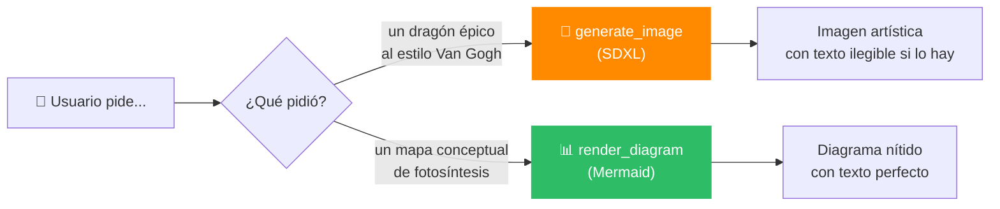
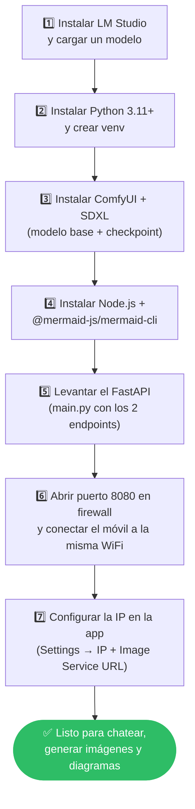
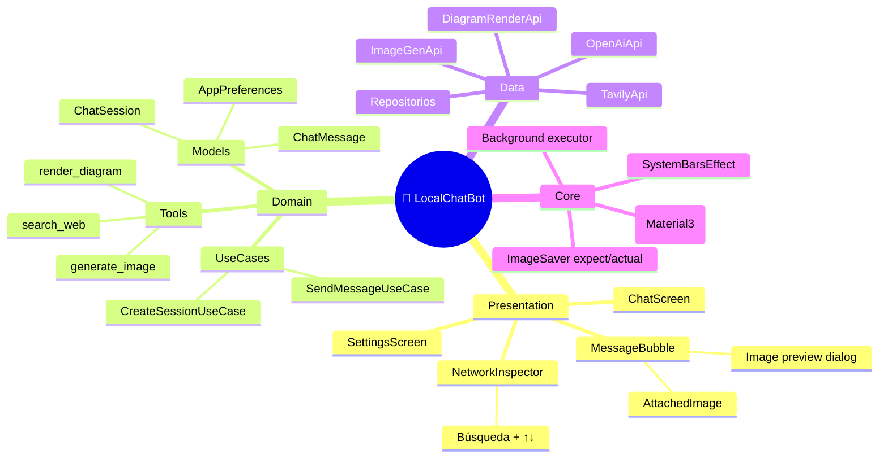

# 🏗️ Arquitectura de LocalChatBot

Documentación visual de cómo está construida la app, cómo habla con tu PC servidor
y qué pasa dentro del servidor cuando le pides algo.

---

## 🌍 Vista general — ¿quién es quién?

**¿Por qué dos servicios en el PC?**
- LM Studio sirve **chat** con un endpoint compatible con OpenAI
- El Image Service sirve **píxeles** (SDXL para imágenes artísticas, mermaid-cli
  para diagramas) — son cosas distintas y conviven en otro puerto

---

## 📲 Anatomía de la app (capas)

**Filosofía:** UI no sabe de HTTP, los UseCases no saben de Ktor, y los DTOs viven
encapsulados en `data/remote`. Si mañana cambias LM Studio por Ollama, solo tocas
`OpenAiApi`.

---

## 💬 ¿Qué pasa cuando mandas un mensaje?

Ejemplo: *"Hazme un mapa conceptual de la fotosíntesis"*

**Sutileza importante:** el base64 del PNG **nunca** viaja al modelo. Si lo
metiéramos en el contexto serían ~30k tokens de basura. En su lugar lo guardamos
out-of-band en un `StateFlow` y lo adjuntamos al `ChatMessage` cuando terminan
las iteraciones.

---

## 🛠️ El bucle de tool-calling

---

## 🖥️ Dentro del servidor

- **LM Studio** ya viene con su propio endpoint compatible con OpenAI — solo
  cargas un modelo y listo.
- **Image Service** es un script FastAPI tuyo. Convive en un solo `main.py` con
  dos endpoints. Comparte el puerto 8080.
- **ComfyUI + SDXL**: pipeline determinista para generar imágenes desde texto.
  Bueno para arte, malísimo para texto legible.
- **mermaid-cli**: arranca un Chromium headless vía Puppeteer y renderiza
  código Mermaid a PNG con texto perfectamente nítido — perfecto para diagramas
  donde SDXL fallaría.

---

## 🎯 ¿Por qué dos formas de "generar imágenes"?

El **system prompt** instruye al modelo a elegir la herramienta correcta. La
regla es:

> Si el resultado debería leerse con letras claras → `render_diagram`.
> Si es algo natural/artístico/fotorealista → `generate_image`.

---

## 🔁 ¿Cómo se reinstala todo si me cambio de PC?

Los detalles concretos están en:
- `ONBOARDING.md` — cómo instalar ComfyUI + SDXL
- `DIAGRAM_SERVICE_SETUP.md` — cómo añadir `/generate-diagram` al `main.py`

---

## 🧰 Componentes clave (mapa mental)

---

## 📌 Tips para los developers

- **Toca una imagen** en el chat → vista previa con botón Guardar (guarda en la
  galería del teléfono)
- **Ajustes → Inspector de red** → ves cada request/response crudo con búsqueda
  y navegación por flechas
- **Long-press en una burbuja** del assistant → Copiar / Regenerar
- **Long-press en tu mensaje** → Editar / Reenviar
- El `imageServiceUrl` por defecto es `auto: <ip-LM-Studio>:8080` — si tu Image
  Service vive en otra máquina, lo cambias manualmente
