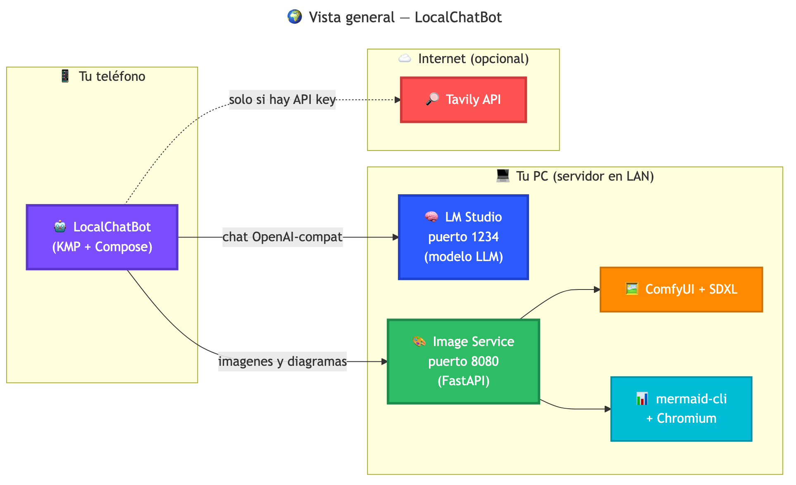
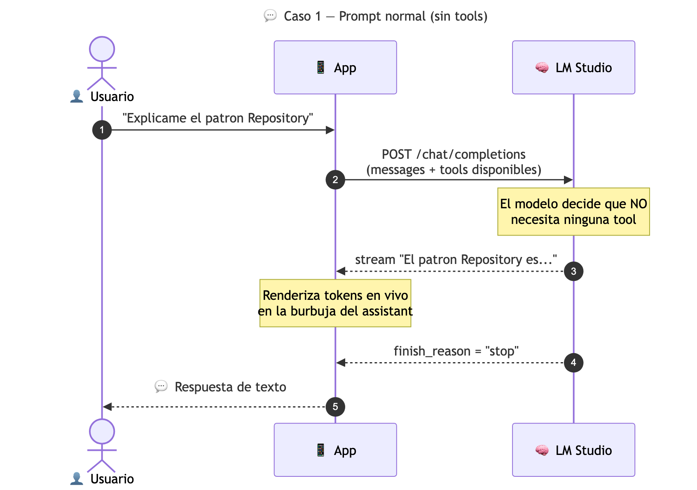
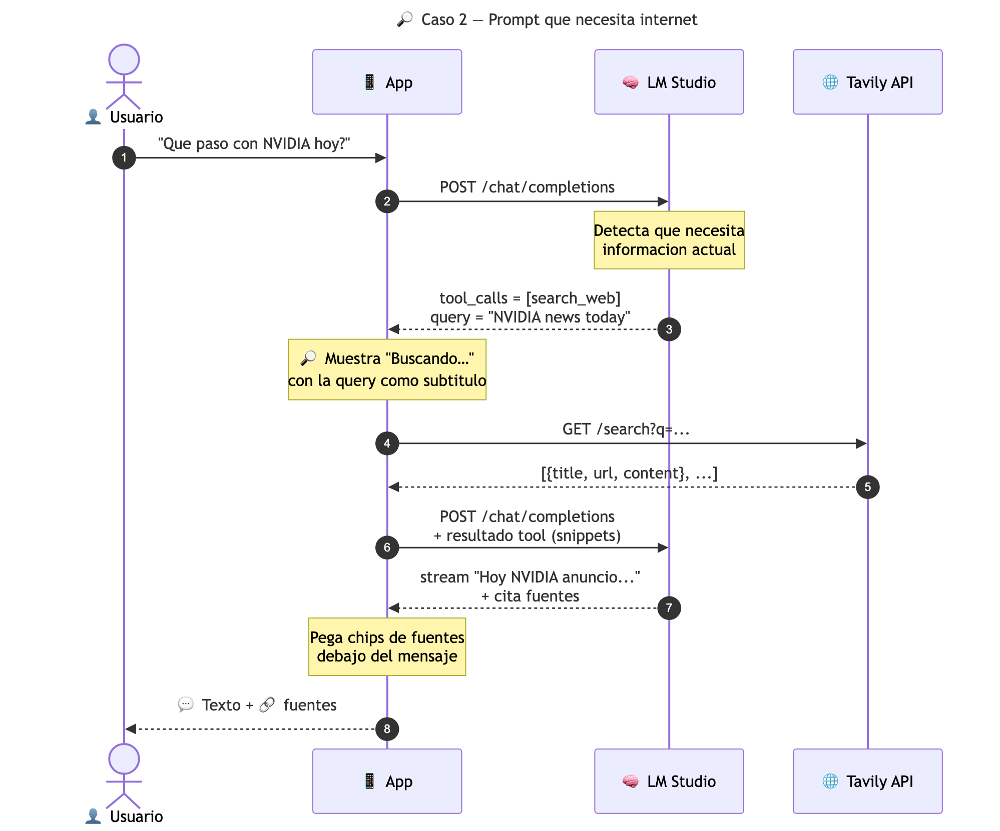
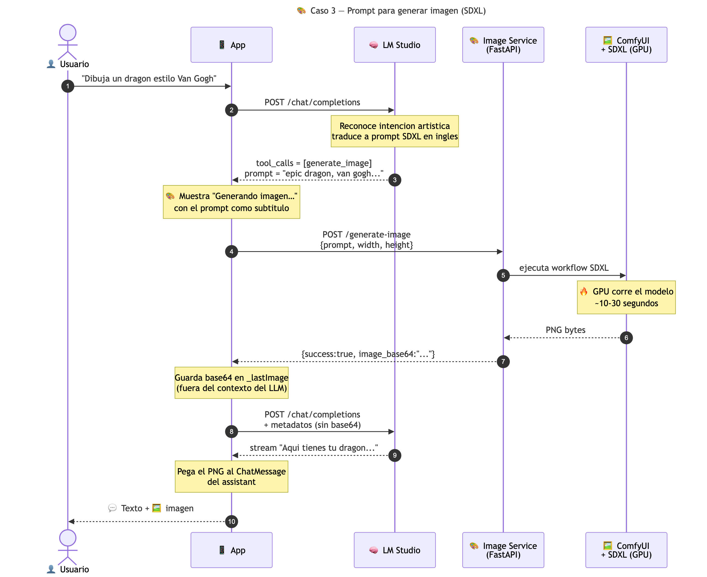
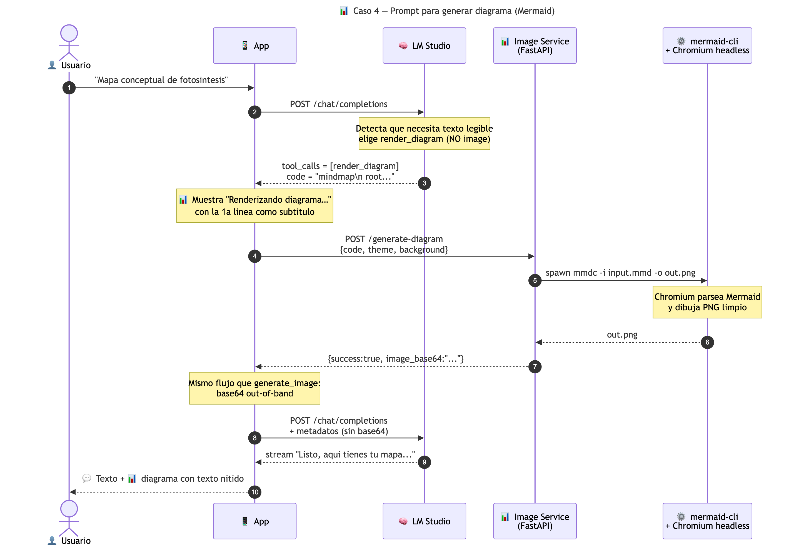

# 🎨 Diagramas ilustrativos — LocalChatBot

Documentación visual de cómo funciona la app, el servidor y los diferentes
casos según el tipo de prompt del usuario. Pensado para ojearlo de un vistazo.

Para una documentación equivalente en formato Markdown (legible directo en
GitHub) mira [`../../ARCHITECTURE.md`](../../ARCHITECTURE.md).

> Todos los PNG se regeneran desde sus `.mmd` con:
> ```bash
> npx -y -p @mermaid-js/mermaid-cli mmdc -i NOMBRE.mmd -o NOMBRE.png -s 2 -w 1600
> ```

---

## 🌍 Vista general

Quién habla con quién. El móvil habla por LAN con tu PC (LM Studio + Image
Service) y opcionalmente con Tavily si tienes API key.



---

## 💬 Caso 1 — Prompt normal

*"Explícame el patrón Repository"* — el modelo no necesita ninguna tool, solo
responde en streaming.



---

## 🔎 Caso 2 — Prompt que necesita internet

*"¿Qué pasó con NVIDIA hoy?"* — el modelo detecta que necesita info actual,
llama a `search_web`, recibe snippets de Tavily, y los integra en su respuesta
añadiendo chips de fuentes en el chat.



---

## 🎨 Caso 3 — Prompt para generar imagen

*"Dibuja un dragón estilo Van Gogh"* — el modelo traduce a un prompt SDXL en
inglés, llama a `generate_image`. ComfyUI corre el modelo en la GPU, devuelve
el PNG, la app lo adjunta out-of-band al mensaje (sin meter el base64 en el
contexto del LLM).



---

## 📊 Caso 4 — Prompt para generar diagrama

*"Mapa conceptual de fotosíntesis"* — el modelo detecta que el resultado debe
tener texto legible, elige `render_diagram` (NO `generate_image`). El server
ejecuta `mmdc` que arranca Chromium headless y parsea el código Mermaid a un
PNG limpio.



---

## 🧠 ¿Por qué `render_diagram` en vez de `generate_image` para diagramas?

Los modelos de difusión (SDXL/FLUX) son **malísimos con texto** — generan
imágenes hermosas pero las letras salen como garabatos. Para diagramas, mapas
conceptuales, flowcharts, etc., usar Mermaid + mermaid-cli es **determinista**
y el texto sale perfecto.

El system prompt del LLM lo instruye a elegir según la intención:

| Si el usuario quiere… | Tool elegida |
|---|---|
| Una imagen artística, retrato, paisaje, dragón épico… | `generate_image` (SDXL) |
| Mapa conceptual, mindmap, flowchart, secuencia, clases, ER, gantt… | `render_diagram` (Mermaid) |
| Información actual (noticias, precios, eventos)… | `search_web` (Tavily) |
| Cualquier otra cosa (explicar, programar, traducir)… | Ninguna — responde directo |
